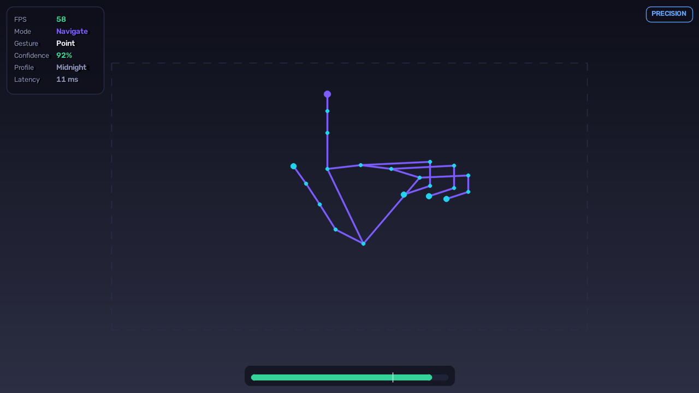
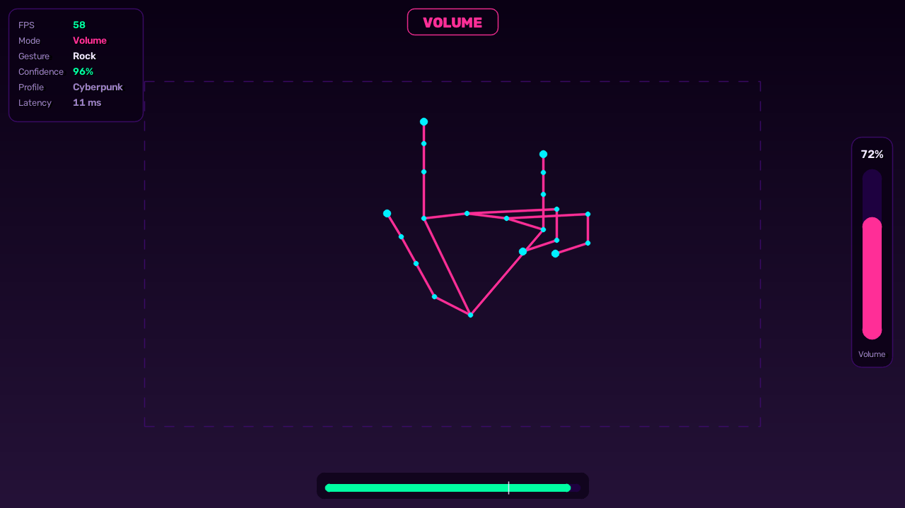

<div align="center">

# ◈ AI Gesture Mouse Pro

**Control your computer with your hands. No mouse, no touchpad, no wearables — just a webcam.**

[](https://python.org)
[](https://developers.google.com/mediapipe)
[](https://opencv.org)
[](#testing)
[](#license)

</div>

---

## Overview

AI Gesture Mouse Pro turns a plain webcam into a full desktop input device. It tracks
your hand at 21 landmarks, classifies what your fingers are doing, and translates that
into cursor movement, clicks, drags, scrolling, volume, brightness, presentations and
air-drawn shortcuts — with a desktop interface for tuning every part of it.

It is built as a real application rather than a demo script: a layered architecture with
a testable core, graceful degradation when optional dependencies are missing, and a test
suite that verifies the recognition pipeline end-to-end **without a camera**.

### The live view

Real output from the overlay renderer — status panel, active-region guide, hand skeleton
and confidence bar with the accept threshold marked.

| Navigate · Midnight theme | Volume mode · Cyberpunk theme |
|---|---|
|  |  |

On the right: holding 🤘 switches to **Volume** mode, the banner names the active mode, and
thumb↔index distance drives the level meter. The dashed rectangle is the *active region* —
the part of the frame mapped to your screen, so you never have to reach the frame edges.

> **Recording your own demo:** run `python app.py` and screen-record the Live view, or use
> the app's own recorder — 🤙 held for a second, or `Ctrl+Alt+S`. Drop the result in
> `docs/media/` and link it here.

---

## Why this is not another `cv2.VideoCapture` tutorial

Most gesture-mouse projects are one file with a threshold on fingertip distance. That
works in a demo and falls apart in use. Here is what the difference actually consists of.

| Problem | Naive approach | What this does |
|---|---|---|
| **Cursor jitter** | Moving average over N frames | [One Euro filter](#the-cursor-pipeline) — adapts cutoff to hand speed, so it is smooth at rest *and* responsive when moving |
| **Perceived lag** | Accept it | Velocity extrapolation hides camera + inference latency |
| **Phantom clicks** | Single distance threshold | Schmitt-trigger hysteresis + N-frame temporal stabilisation |
| **Different hand sizes** | Hard-coded pixel thresholds | Every distance normalised by palm size → invariant to hand size *and* camera distance |
| **Gesture conflicts** | Add more finger poses | [Modal state machine](#modes) — a pinch means "click" in Navigate and "set level" in Volume |
| **Camera latency** | `cap.read()` in the loop | Dedicated capture thread, latest-frame-wins (OpenCV buffers internally) |
| **Custom gestures** | Train a model | [$1 recogniser](#dynamic-gestures-why-1-and-not-an-lstm) — learns from a *single* example, explainable score |
| **Testing** | Point a hand at it | Kinematic hand model synthesises landmarks; 43 tests run headless in CI |
| **A stuck mouse button** | Hope | Releases are ungated and unconditional — see [Safety](#safety) |

---

## Features

<details open>
<summary><b>Core input</b></summary>

- Cursor movement with adjustable sensitivity, speed, smoothing, dead zone and motion prediction
- Left / right / middle click, double click, click-and-hold
- Drag and drop with a hold-to-engage threshold
- Vertical scrolling with sub-tick accumulation
- Two-handed pinch zoom
- Precision mode for fine positioning
- Multi-monitor support with automatic layout detection

</details>

<details open>
<summary><b>Recognition</b></summary>

- 21-landmark tracking via MediaPipe Hands, one or two hands
- 12 static poses with continuous confidence scoring
- 9 air-drawn shapes (circle, triangle, square, Z, S, wave, check, caret…)
- 4 directional swipes
- Custom gesture recording with self-consistency validation
- Automatic hand-dominance detection

</details>

<details open>
<summary><b>System control</b></summary>

- Volume and brightness via continuous pinch-distance mapping
- Screenshots with shutter sound, screen recording to MP4
- Media playback, session lock, application launcher
- Browser back/forward, window switching
- 41 bindable actions in total, all rebindable

</details>

<details open>
<summary><b>Application</b></summary>

- Eight-view desktop interface: Live, Dashboard, Gestures, Performance, Profiles, History, Logs, Settings
- Five themes plus a high-contrast accessibility variant
- Calibration wizard that measures *your* hand and derives settings
- Five profile presets (Default, Gaming, Office, Presentation, Accessibility)
- Virtual whiteboard with vector strokes, undo/redo and export
- Air presentation mode with four laser-pointer styles
- Gesture history with CSV export, analytics and a spatial heatmap
- Real-time performance monitoring with p50/p95/p99 latency
- Live log viewer with level filtering, fed from an in-memory ring buffer
- Optional voice commands and presence-based auto-lock
- Single-file plugin system for user-defined actions

</details>

---

## Installation

### Requirements

- **Python 3.10 – 3.13** (3.12 recommended; MediaPipe support beyond 3.13 varies by platform)
- A webcam
- macOS, Windows or Linux

### Setup

```bash
git clone https://github.com/<you>/gesture-mouse-pro.git
cd gesture-mouse-pro

python -m venv .venv
source .venv/bin/activate          # Windows: .venv\Scripts\activate

pip install -r requirements.txt
python app.py
```

On first run the app downloads the MediaPipe hand-landmark model (~7.5 MB) into
`assets/models/`. Every run after that is fully offline.

### Platform notes

<details>
<summary><b>macOS</b> — permissions and a Homebrew Python bug</summary>

Grant two permissions in **System Settings → Privacy & Security**:

- **Camera** → allow your terminal or IDE (required)
- **Accessibility** → allow your terminal or IDE (required for cursor control and global hotkeys)

Tkinter is not bundled with Homebrew Python:

```bash
brew install python-tk@3.13
```

**If MediaPipe fails to import** with `Symbol not found: _XML_SetAllocTrackerActivationThreshold`,
your Homebrew Python has a broken `pyexpat`. It links against the system libexpat, which
no longer exports a symbol it needs. This breaks MediaPipe (whose import chain reaches XML
parsing through matplotlib) and CustomTkinter. Fix it with the bundled script:

```bash
brew install expat
python scripts/fix_macos_expat.py
```

It builds a corrected copy of the extension inside your virtualenv and touches nothing
outside it. Use `--check` to diagnose and `--undo` to revert.

</details>

<details>
<summary><b>Windows</b> — volume and brightness</summary>

```bash
pip install pycaw comtypes screen-brightness-control
```

Both are optional; without them those two features report as unavailable in
**Settings → System Capabilities** and everything else works normally.

</details>

<details>
<summary><b>Linux</b> — volume, brightness and permissions</summary>

Volume uses `pactl` (PulseAudio/PipeWire) and brightness uses
`screen-brightness-control`, both available on most desktops.

`pynput` needs access to the X11 or uinput device. On Wayland, cursor control may
require running under XWayland.

</details>

### Command line

```bash
python app.py                      # desktop application
python app.py --headless --stats   # no UI, live stats in the terminal
python app.py --profile Gaming     # start with a named profile
python app.py --list-cameras       # probe available camera indices
python app.py --no-cursor          # recognise gestures without moving the mouse
python app.py --debug              # verbose logging
```

---

## Gesture reference

### Pointing and clicking

| Gesture | Action |
|---|---|
| ☝️ Index finger extended | Move the cursor |
| 🤏 Thumb + index touch, release quickly | Left click |
| 🤏🤏 Two quick pinches | Double click |
| Thumb + **middle** finger touch | Right click |
| Thumb + **ring** finger touch | Middle click |
| 🤏 Pinch and hold ~0.45 s, then move | Drag — release to drop |
| ✊ Fist held 1 s | Toggle click-and-hold |

### Modes

Holding a pose switches mode; the mode changes what continuous hand motion means.
This is how the gesture set stays small while covering many controls.

| Pose | Mode | Continuous input |
|---|---|---|
| ✌️ Index + middle | **Scroll** | Vertical hand travel scrolls |
| 🤘 Index + pinky | **Volume** | Thumb↔index distance sets level |
| Index + middle + ring | **Brightness** | Thumb↔index distance sets level |
| 👆 Thumb + index at 90° | **Precision** | Cursor gain drops to ~28 % |
| Two hands pinching | **Zoom** | Hand separation zooms |

### Holds and shapes

| Gesture | Action |
|---|---|
| 🖐️ Open palm held 1 s | Sleep / wake tracking |
| 👌 OK sign held 1 s | Screenshot |
| 🤙 Thumb + pinky held 1 s | Start / stop screen recording |
| Pinky only, held | Toggle whiteboard |
| Four fingers, thumb tucked | Toggle presentation mode |
| Swipe ← / → | Browser back / forward |
| Draw ○ | Open browser |
| Draw △ | Open VS Code |
| Draw □ | Open terminal |
| Draw ∿ | Toggle mute |
| Draw Z | Open Spotify |
| Draw ✓ | Lock screen |

Every binding above is a **default**. Rebind anything in **Gestures**, or record your own
shape and bind it to any of the 41 actions.

### Keyboard shortcuts

| Shortcut | Action |
|---|---|
| `Ctrl+Alt+Q` | **Emergency stop** — release all input immediately |
| `Ctrl+Alt+Space` | Pause / resume tracking |
| `Ctrl+Alt+P` | Toggle precision mode |
| `Ctrl+Alt+S` | Screenshot |
| `Ctrl+Alt+W` | Toggle whiteboard |
| `Ctrl+Alt+D` | Toggle presentation mode |
| `Ctrl+Alt+C` | Recentre cursor |

---

## Architecture

### Layers

```
┌─────────────────────────────────────────────────────────────────────┐
│  PRESENTATION            ui.py · dashboard.py · overlay.py          │
│                          notifications.py · themes.py               │
├─────────────────────────────────────────────────────────────────────┤
│  ORCHESTRATION           app.py                                     │
│                          threading · lifecycle · state publication  │
├─────────────────────────────────────────────────────────────────────┤
│  DOMAIN                  gesture_engine.py · dynamic_gestures.py    │
│  (pure, no side effects) calibration.py · gesture_recorder.py       │
├─────────────────────────────────────────────────────────────────────┤
│  EFFECTS                 actions.py · cursor_controller.py          │
│                          whiteboard.py · presentation.py · voice.py │
├─────────────────────────────────────────────────────────────────────┤
│  INFRASTRUCTURE          detector.py · platform_bridge.py           │
│                          screen_capture.py · sounds.py · security.py│
├─────────────────────────────────────────────────────────────────────┤
│  FOUNDATION              config.py · utils.py · logger.py           │
│                          settings.py · history.py · performance.py  │
└─────────────────────────────────────────────────────────────────────┘
```

The critical boundary is between **domain** and **effects**. `gesture_engine.py` never
moves the mouse, never changes the volume, never touches the filesystem. It consumes
landmarks and emits `GestureEvent` objects describing *what happened*. `actions.py`
decides what to do about them.

That split buys three things: the entire recognition path is unit-testable with no
desktop session, users can rebind any gesture to any action without recognition code
changing, and plugins can add actions without touching either side.

### Threading

```
   camera thread          processing thread              Tk main thread
   ─────────────          ─────────────────              ──────────────
   VideoCapture.read()
        │
        └── latest frame ──► MediaPipe inference
            (overwrite,          │
             never queue)   gesture recognition
                                 │
                            cursor + actions
                                 │
                            overlay render
                                 │
                            SharedState ──(mutex)──► poll @ 30 Hz
                                                          │
                                                     widgets
```

Three rules keep this simple:

1. **The camera thread never blocks on a consumer.** It overwrites a single slot. A slow
   consumer sees a dropped frame, never a growing backlog. OpenCV buffers frames
   internally, so `cap.read()` in the render loop accumulates seconds of latency.
2. **Actions run on the processing thread**, not the UI thread. A slow action — launching
   an application, encoding a screenshot — delays the next gesture rather than freezing
   the interface.
3. **Only the Tk thread touches widgets.** Notifications raised from the pipeline marshal
   across via `after(0, ...)`.

State crosses between threads through one mutex-guarded snapshot rather than shared
object references. That is what makes the UI genuinely optional: `--headless` runs the
identical pipeline with no Tk imported at all.

### The recognition pipeline

```
frame ─► MediaPipe ─► HandLandmarks ─► HandFeatures ─► PoseMatch ─► stable pose
                          21×(x,y,z)     extensions      + confidence      │
                                         pinch dists                       ▼
                                         orientation                mode machine
                                         palm size                        │
                                                                          ▼
                          MotionTrail ─► $1 recogniser ─────────► GestureEvent
                          (last 64 pts)   + swipe detector              │
                                                                        ▼
                                                    gates: enabled → confidence
                                                         → per-gesture cooldown
                                                         → global cooldown
                                                                        │
                                                                        ▼
                                                                ActionRegistry
```

### Design decisions worth explaining

<details open>
<summary><b>Scale invariance via palm size</b></summary>

Every distance in the engine is divided by the wrist→middle-MCP distance before being
compared to a threshold:

```python
def normalized_distance(self, a: int, b: int) -> float:
    return distance_2d(self.points[a], self.points[b]) / self.palm_size
```

A threshold tuned for one person then works for a child's hand, an adult's hand, and for
someone sitting twice as far from the camera. Without this, every threshold is implicitly
a function of user and seating position, which is why hard-coded gesture demos only work
for their author.

</details>

<details open>
<summary><b>Continuous scores, not booleans</b></summary>

A finger is not "extended" or "curled" — it has an extension score in `[0, 1]`, derived
from the PIP joint angle and a tip-versus-PIP reach test:

```python
angular = smoothstep(_CURLED_ANGLE, _EXTENDED_ANGLE, angle)
reach   = smoothstep(0.98, 1.22, tip_reach / pip_reach)
return clamp(0.72 * angular + 0.28 * reach, 0.0, 1.0)
```

Gesture confidence then falls out of the pose match naturally rather than being invented
afterwards, and a near-miss pose scores low instead of flapping between two hard
classifications. Pose matching weights the *weakest* finger heavily (`0.55·mean +
0.45·min`) so one clearly wrong finger sinks the match rather than being averaged away by
four correct ones.

</details>

<details open>
<summary><b>The cursor pipeline</b></summary>

Four stages, in order:

1. **Active-region mapping.** Only a central sub-rectangle of the frame maps to the
   screen, so ~25 cm of hand travel covers a 27″ display instead of requiring you to reach
   the frame edges.
2. **Dead zone.** Sub-threshold motion is discarded *before* filtering, so a still hand
   leaves the cursor perfectly still — essential for clicking small targets.
3. **One Euro filter.** A plain exponential filter forces one trade-off: smooth but laggy,
   or responsive but jittery. The 1 € filter makes the cutoff frequency a function of
   speed, filtering hard at rest and relaxing during fast movement.
4. **Velocity prediction.** Position is extrapolated ~35 ms ahead using a least-squares
   velocity fit, hiding the camera and inference latency that otherwise makes the cursor
   feel like it is dragging behind the hand.

</details>

<details open>
<summary><b>Dynamic gestures: why $1 and not an LSTM</b></summary>

The obvious modern answer for air-drawn shapes is a recurrent net. For this problem it is
the wrong trade:

- Users must be able to record a gesture **once** and have it work — that is one-shot
  learning, not a training-set problem.
- A misfire opens the wrong application, so the score must be **explainable and tunable**,
  not a black-box logit.
- It has to run in the frame budget alongside inference.

The [$1 Unistroke Recognizer](https://depts.washington.edu/acelab/proj/dollar/index.html)
(Wobbrock et al., UIST 2007) resamples a stroke to 64 points, rotation-normalises,
scales, translates to the origin, and scores against stored templates using Protractor's
closed-form angular distance. It learns from a single example, runs in microseconds, and
produces a bounded `[0, 1]` score.

**Measured:** 100 % recognition across 500 synthesised strokes with randomised noise,
scale, translation and sample count (mean score 0.91 – 0.97).

Directional swipes are handled *outside* $1 deliberately: the algorithm normalises away
rotation, so a left swipe and a right swipe reduce to the identical template. It
structurally cannot tell them apart. A direct test on net displacement and path
straightness is both correct and cheaper.

</details>

<details open>
<summary><b>Two MediaPipe backends</b></summary>

Google ships two incompatible hand-tracking APIs and which one you get depends on your
Python version and platform build:

- **Solutions API** (`mediapipe.solutions.hands`) — bundled model, works offline immediately
- **Tasks API** (`mediapipe.tasks.python.vision.HandLandmarker`) — current generation,
  needs an external `.task` model, and is the *only* API present on newer builds

Rather than pinning users to one interpreter, `detector.py` probes for both behind a
`DetectorBackend` interface and emits identical `HandLandmarks` either way. Nothing
downstream knows which is active.

</details>

<details open>
<summary><b>Calibration derives settings from measurements</b></summary>

Four stages measure hand size, pinch range, comfortable reach and hand tremor, then derive
thresholds using **percentiles, not min/max** — one bad landmark frame must not define
your entire pinch range.

The pinch threshold is anchored near the *closed* end of your measured range, not its
midpoint. Placing it partway toward an open hand means fingers merely drifting inward
register as a click. Hysteresis is enforced so a degenerate measurement cannot collapse
the close and release thresholds onto each other.

</details>

---

## Safety

Driving the system cursor from a probabilistic vision model needs explicit safeguards.

| Risk | Mitigation |
|---|---|
| Runaway cursor | `Ctrl+Alt+Q` emergency stop releases all input and disables the cursor |
| **Stuck mouse button** | Releases are **ungated** — see below |
| Hand leaves frame mid-drag | Tracking loss releases the button automatically |
| Accidental clicks | Confidence floor + N-frame stabilisation + hysteresis + cooldowns |
| Someone else in frame | Optional presence detection pauses tracking when you leave |
| Crash leaving input held | `emergency_release()` on shutdown clears all three buttons unconditionally |

The release rule is worth stating explicitly, because it is the one place where the
obvious symmetry is wrong:

```python
RELEASE_GESTURES = frozenset({"drag_end"})
# You must be confident to ENGAGE a control, never to RELEASE one.
```

Gating a release behind a confidence threshold means that exactly when tracking degrades —
poor light, fast motion, hand partially out of frame — the button stays held. Releases
therefore bypass both the confidence and cooldown gates. Likewise `emergency_release()`
releases all three buttons whether or not it believes they are held: if internal state
ever disagrees with the OS, the safe direction to be wrong is releasing a button that was
already up.

---

## Testing

```bash
python tests/run_all.py       # everything, no pytest needed
pytest tests/ -v              # or with pytest
```

```
test_dynamic_gestures ....... 11 passed
test_gesture_engine ......... 23 passed
test_integration ............  9 passed
                              ─────────
                              43 passed in 8.3s
```

**The interesting part is that these run without a camera.**
`tests/synthetic_hand.py` is a small kinematic model that generates anatomically plausible
21-landmark hands from a parameter vector (per-finger curl + thumb abduction), matching
MediaPipe's topology exactly. Poses can then be generated, perturbed with controlled
noise, and asserted on:

```python
POSE_PRESETS["Peace"] → build_landmarks(noise=0.035) → extract_features() → classify()
```

`tests/test_integration.py` drives the real `GestureMouseApp` with a scripted detector and
a *recording* mouse backend, so the full engine → cursor → action → history → overlay path
is exercised while never actually clicking on the developer's desktop.

### Bugs this suite caught

These are real defects found by writing the tests, not hypotheticals:

- **The first click of every session registered as a double click.** `_last_click_time`
  initialised to `0.0` while engine timestamps also start near zero, so the first click
  always fell inside the double-click interval.
- **`drag_start` was silently suppressed.** It was gated on *static pose* confidence, but a
  pinching hand matches the L-shape pattern, which the pose library deliberately penalises
  via `requires_no_pinch`. Pose confidence therefore collapsed at exactly the moment the
  pinch fired. Pinch events now carry their own measured confidence.
- **Releases were gated.** `drag_end` was subject to the confidence and cooldown gates,
  risking a permanently held mouse button whenever tracking degraded.
- **The calibration wizard produced an unusable pinch threshold** (0.238 — roughly a
  fully open hand), so fingers drifting inward would click.
- **`GestureRecorder` could never leave its countdown state**, because `start()` anchored
  the deadline to `time.monotonic()` while `update()` takes a caller-supplied timestamp.
- **`PresenceMonitor` loaded a TFLite model at startup** even with presence detection
  disabled, the default.

---

## Project structure

```
gesture-mouse-pro/
├── app.py                  Entry point, orchestration, threading
├── config.py               Dataclass configuration tree + presets
├── compat.py               Environment shims (must import first)
│
├── detector.py             Threaded camera + dual-backend MediaPipe
├── gesture_engine.py       Features, poses, modes, event emission
├── dynamic_gestures.py     $1 recogniser + swipe detection
├── cursor_controller.py    Mapping, filtering, prediction, mouse output
├── actions.py              41 bindable actions + macro recorder
├── calibration.py          Measurement wizard
├── gesture_recorder.py     Custom gesture capture + library
│
├── ui.py                   Main window, eight views
├── dashboard.py            Canvas widgets (tiles, sparklines, gauges)
├── overlay.py              Camera HUD renderer
├── notifications.py        Toast system
├── themes.py               Five themes + high-contrast variant
│
├── settings.py             Profile management
├── history.py              Gesture log, analytics, CSV export
├── performance.py          FPS, latency percentiles, resources
├── platform_bridge.py      OS abstraction (volume/brightness/apps)
├── screen_capture.py       Screenshots + screen recording
├── whiteboard.py           Vector drawing canvas
├── presentation.py         Slide control + laser pointer
├── voice.py                Optional speech commands
├── security.py             Presence detection + auto-lock
├── plugins.py              Plugin loader + API
├── sounds.py               Procedurally generated audio cues
├── utils.py                Filters, geometry, timing primitives
├── logger.py               Rotating logs + UI ring buffer
│
├── tests/
│   ├── run_all.py          Suite runner (no pytest required)
│   ├── synthetic_hand.py   Kinematic landmark generator
│   ├── test_gesture_engine.py
│   ├── test_dynamic_gestures.py
│   └── test_integration.py
│
├── scripts/fix_macos_expat.py
├── plugins/example_plugin.py
├── docs/                   Architecture and gesture reference
└── requirements.txt
```

---

## Extending

### Write a plugin

Drop a file in `plugins/`:

```python
PLUGIN_NAME = "My Plugin"

def register(api):
    def handler(ctx, event):
        ctx.notify("Hello", f"Fired by {event.name}")
        return True

    api.add_action("greet", "Say Hello", "Plugins", handler)
    api.add_shell_action("notes", "Open Notes", ["open", "-a", "Notes"])
    api.add_url_action("docs", "Open Docs", "https://example.com")
```

Your action appears in **Gestures** and can be bound to any gesture, including one you
record. Action ids are namespaced by filename so plugins cannot collide.

Plugins are ordinary Python modules executed in-process — there is no sandbox, and the
trust model is that of a shell rc file. The loader only ever imports from the local plugin
directory, so installing one is always a deliberate act.

### Add a static pose

Poses are data, not code. Append to `POSE_LIBRARY` in `gesture_engine.py`:

```python
PoseDefinition(
    Pose.SPOCK, (0, 1, 1, 0, 1),   # thumb→pinky: 1 = extended, 0 = curled, None = any
    priority=1.05,
    description="Index + middle + pinky",
)
```

### Add a theme

Drop a JSON token table in `assets/themes/` — it is picked up at startup and appears in
the theme picker.

---

## Roadmap

- [ ] Temporal model (TCN or lightweight transformer) over landmark sequences, as an
      *optional* backend alongside $1 rather than a replacement
- [ ] GPU inference via MediaPipe delegates
- [ ] Per-application profiles that switch automatically on window focus
- [ ] Kalman filter as an alternative to One Euro, with an A/B comparison harness
- [ ] Encrypted cloud profile sync
- [ ] Windows/macOS installers via PyInstaller
- [ ] Localisation

---

## Troubleshooting

| Symptom | Cause and fix |
|---|---|
| `Cannot open camera index 0` | Another app is using it, or camera permission is denied. Try `python app.py --list-cameras` |
| Cursor does not move (macOS) | Grant **Accessibility** to your terminal in System Settings → Privacy & Security |
| `Symbol not found: _XML_SetAlloc…` | Broken Homebrew `pyexpat`. Run `brew install expat && python scripts/fix_macos_expat.py` |
| `No module named '_tkinter'` | `brew install python-tk@3.13` (or your version) |
| `No usable MediaPipe backend` | Reinstall: `pip install --force-reinstall mediapipe` |
| Low FPS | Lower **Inference Scale** in Settings → Camera, or use the Gaming profile (model complexity 0) |
| Jittery cursor | Raise **Smoothing** and **Dead Zone**, or run the calibration wizard |
| Cursor feels laggy | Lower **Smoothing**, raise **Motion Prediction** |
| Accidental clicks | Raise **Minimum Confidence** and **Stability Frames**, or lower **Pinch Threshold** |
| Brightness does nothing | No backend on macOS — `brew install brightness`. Check Settings → System Capabilities |

Logs are written to `logs/gesture-mouse-pro.log` (rotating, 5 × 2 MB).

---

## Contributing

Contributions are welcome.

1. Fork and branch: `git checkout -b feature/thing`
2. Keep the layer boundaries — recognition code stays side-effect free
3. Add tests; if it touches recognition, use `synthetic_hand.py` rather than a camera
4. Run `python tests/run_all.py` before opening a PR
5. Follow the existing style: PEP 8, type hints, docstrings explaining *why*

Good first issues: a new pose in `POSE_LIBRARY`, a new theme, a plugin, or a new stroke
template in `builtin_templates()`.

---

## Acknowledgements

- [MediaPipe](https://developers.google.com/mediapipe) — hand landmark detection
- **Casiez, Roussel & Vogel (CHI 2012)** — [1 € Filter](https://gery.casiez.net/1euro/)
- **Wobbrock, Wilson & Li (UIST 2007)** — [$1 Unistroke Recognizer](https://depts.washington.edu/acelab/proj/dollar/index.html)
- **Li (2010)** — Protractor closed-form gesture scoring
- [OpenCV](https://opencv.org), [CustomTkinter](https://github.com/TomSchimansky/CustomTkinter), [pynput](https://github.com/moses-palmer/pynput)

---

## License

MIT — see [LICENSE](LICENSE).

<div align="center">
<sub>Built with computer vision, signal processing, and a healthy distrust of single thresholds.</sub>
</div>
